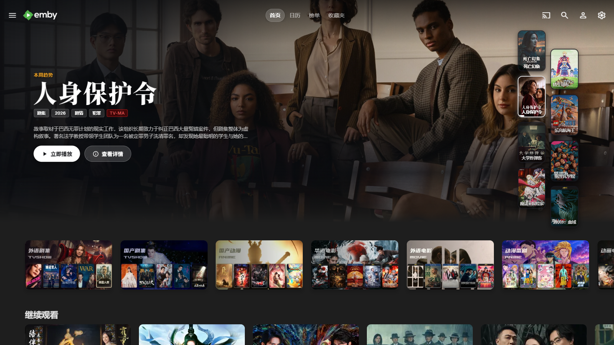
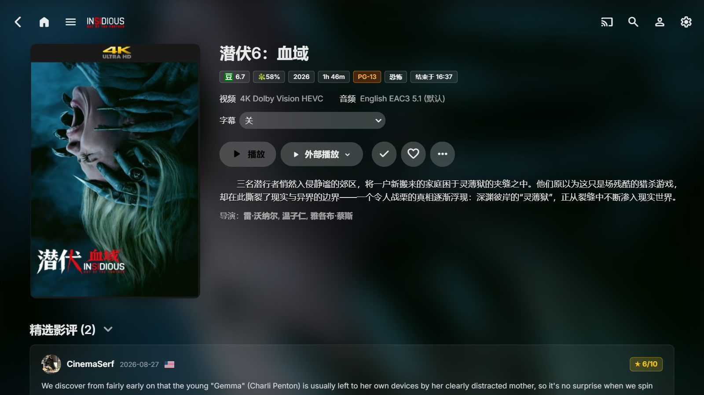
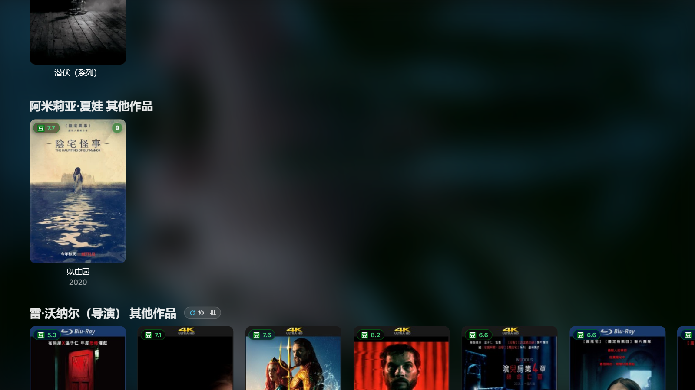
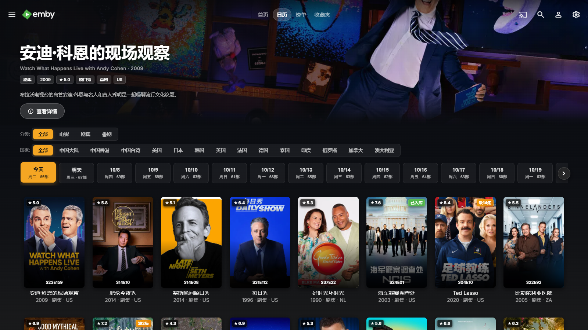
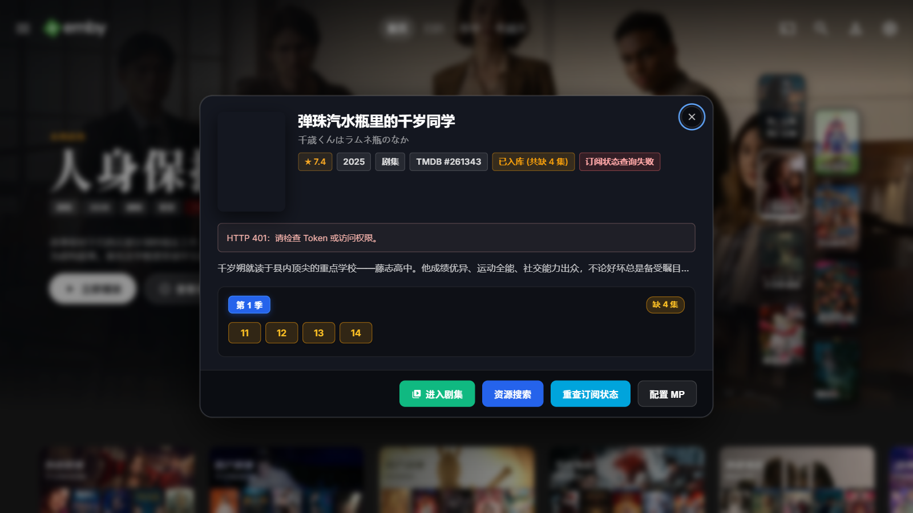

# Emby_Plus

> **Emby 纯原生全景现代化美化与功能增强套件**  
> *Vanilla JavaScript / Pure CSS · Zero Dependencies · Instant Plug-and-Play*

[](LICENSE)
[](https://emby.media/)
[](#-方案选型二选一)

---

## 📖 项目简介

**Emby_Plus** 是一套专为 Emby Web 与桌面端客户端打造的轻量级、无侵入式全景美化与功能增强套件。

### 核心功能
1. 🎬 **电影院级首页轮播大图**：高质感电影海报大屏、动态胶卷底片栏、平滑横向轮播；
2. 🏷️ **高质感海报丰富元数据**：IMDb / 烂番茄 / 4K UHD / HDR10 / 杜比全景声 / 年龄分级高质感微标；
3. 📺 **详情页四合一排版优化**：季集平铺网格排版、列表多选控制栏、连载/完结状态角标；
4. ⭐ **全站海报专属评分角标**：依据元数据区分豆瓣「豆」、IMDb、TMDB 品牌标识；
5. 💬 **TMDB 精选影评长文**：真实观众长评、影评人头像、星级评分、多语种国旗与折叠展开；
6. 🖼️ **同人剧照画廊轮播**：详情页专属高清剧照平铺预览；
7. 🎭 **演职人员作品联动**：参演作品横向联动面板，正圆头像；
8. 📅 **追剧日历与热门榜单**：8 大流媒体平台矢量 Logo、TOP 1 焦点图、Netflix 大数字排行榜；
9. 🚀 **MoviePilot 深度联动控制台**：缺集数字药丸轨道、资源搜索、一键订阅、权限独立自控；
10. 🎯 **原生质感外部播放器菜单**：与原生主播放键 100% 孪生质感，彻底消除突兀白框。

---

## 🌟 方案选型（二选一）

项目提供两种部署形态，效果完全等价，按需选用：

| 方案 | 交付文件 | 适用场景 | 优势 |
|---|---|---|---|
| 🌟 **Full 一体化全量版（强烈推荐）** | `Emby_Plus.full.js`<br>`Emby_Plus.full.css` | 追求**最稳定、最高性能、开箱即用**的用户 | **仅需 1 个 JS + 1 个 CSS**，所有功能全量内置，无碎片文件，零异步加载竞争，冷启动速度极快 |
| 🧩 **按需组装模块化版** | `Emby_Plus.js`<br>`Emby_Plus.css`<br>`addons/*.js` | 需要**按需精简、自由启闭部分功能**的高级用户 | 核心大图宿主 + 10 个独立 Addon，每个功能独立单文件，自带独立样式动态注入 |

---

## 📸 一、效果总览

<table>
  <tr>
    <td align="center"><br><sub>① 首页大图轮播（海报大图/双列预览/丰富元数据）</sub></td>
    <td align="center"><br><sub>② 详情页全景与排版（季集换行平铺）</sub></td>
    <td align="center"><br><sub>③ 全站海报评分角标（豆瓣/IMDb/TMDB渠道区分）</sub></td>
  </tr>
  <tr>
    <td align="center"><br><sub>④ TMDB 精选影评（长文折叠展开/多语种国旗）</sub></td>
    <td align="center"><br><sub>⑤ 详情页剧照 / 同人图画廊板块</sub></td>
    <td align="center"><br><sub>⑥ 演职人员其他作品联动</sub></td>
  </tr>
  <tr>
    <td align="center"><br><sub>⑦ 追剧日历 Tab（放送排期/流媒体/首播季终/缺集检查）</sub></td>
    <td align="center"><br><sub>⑧ 热门榜单 Tab（8大流媒体Logo/多地区实时榜单）</sub></td>
    <td align="center"><br><sub>⑨ MoviePilot 联动（缺集控制台/资源搜索/订阅）</sub></td>
  </tr>
</table>

---

## 🛠️ 二、三种安装方式（任选其一，推荐方式 A）

### 方式 A：CustomCssJS 插件（最推荐，支持无重启热更新）

1. 在 Emby 后台安装插件 **Custom Css and JavaScript**；
2. **使用 Full 一体化全量版（推荐）**：
   - 「自定义 JS」添加一条：名称填 `Emby_Plus`，内容粘贴 `Emby_Plus.full.js`，状态设置为 **强制开启**；
   - 「自定义 CSS」添加一条：名称填 `Emby_Plus`，内容粘贴 `Emby_Plus.full.css`，状态设置为 **强制开启**；
3. **若使用按需模块化版**：
   - 粘贴 `Emby_Plus.js` 与 `Emby_Plus.css` 为宿主；按需将 `addons/*.js` 添加为独立 JS 条目开启；
4. 保存配置后前台按 `Ctrl + F5` 强制刷新浏览器即可生效。

> 修改 `addons/` 或宿主后，先执行 `python scripts/build_full.py` 重新生成 Full 双文件（自动扫描 addons、抽取组件样式与配置），再用 `scripts/sync_emby.py` 热推送。
>
> 提示：仓库自带 `scripts/sync_emby.py`，支持一条命令将本地修改热推送到 Emby 服务端内存（HTTP 状态 204），完全无需重启容器。

### 方式 B：不依赖插件（服务端原生注入）

1. 将文件放到 Emby 服务端 `dashboard-ui` 目录（Docker 常见路径为 `/system/dashboard-ui`）；
2. 在 `index.html` 的 `</body>` 前按序引入：
   ```html
   <link rel="stylesheet" href="Emby_Plus.full.css" />
   <script src="Emby_Plus.full.js"></script>
   ```
3. 强刷浏览器即可。

### 方式 C：油猴脚本（Tampermonkey）

代码自带 `// ==UserScript==` 元数据头，支持直接导入油猴脚本管理器中运行。

---

## 🧩 三、10 个 Addon 组件概览

如需按需使用分体组件，组件清单如下。详细技术原理、实现细节与独立配置参数请查阅 👉 [**`addons/README.md` 组件详尽文档**](addons/README.md)：

| 序号 | 规范文件名 | 标识符 (id) | 功能简述 | 独立配置项 |
|:---:|---|---|---|---|
| **01** | `01-外链品牌Logo.js` | `link-logos` | 详情页品牌外链（透明豆瓣/IMDb/TMDB/TheTVDB/Trakt）及烂番茄自动匹配 | 无需配置，开箱即用 |
| **02** | `02-卡片分级徽章.js` | `media-ratings` | 媒体库海报卡片彩色年龄分级胶囊徽章（区分不同等级颜色） | 开箱即用 |
| **03** | `03-集页面美化.js` | `season-page` | 剧集详情页紧凑排版、季集平铺网格、多选操作栏、海报角标隔离 | 开箱即用 |
| **04** | `04-TMDB影评.js` | `tmdb-reviews` | 影视详情页 TMDB 精选影评板块（多语种国旗、长文折叠展开） | 组件内可配置独立 Key |
| **05** | `05-剧照画廊.js` | `stage-photos` | 详情页同人剧照画廊轮播与预览画廊 | 开箱即用 |
| **06** | `06-演职人员作品.js` | `person-works` | 演员/导演参演作品联动面板与横向单行防折行平滑滚动 | 开箱即用 |
| **07** | `07-海报评分角标.js` | `poster-ratings` | 全站海报角标（严格区分豆瓣、IMDb、TMDB 品牌标识，彻底消除重复） | 开箱即用 |
| **08** | `08-播放器美化.js` | `player-beauty` | 原生播放器进度条、音量控件磨砂美化与章节操作栏对齐 | 开箱即用 |
| **09** | `09-追剧日历与热门榜单.js` | `calendar-charts-tab` | 顶栏双 Tab（追剧日历 + 8大流媒体热门榜单，与首页无缝融合） | 见组件内 `CONFIG` |
| **10** | `10-MoviePilot联动.js` | `moviepilot` | 详情弹窗与 MoviePilot 联动控制台（缺集药丸、资源搜索、一键订阅） | `requireAdmin` 可配 |

---

## ⚙️ 四、全局配置项 (`CINEMA_CONFIG`)

主脚本头部提供纯净的基础运行参数，修改即可生效：

主脚本头部提供纯净的基础运行参数，修改即可生效：

```javascript
const CINEMA_CONFIG = window.CINEMA_CONFIG = {
    /* 轮播大图设置 */
    autoPlay: true,                          // 是否开启大图自动轮播
    rotationDuration: 5000,                  // 轮播切片轮转间隔时间 (毫秒)
    maxSlides: 10,                           // 大图轮播最大展示条目数
    enableBannerMetadata: true,              // 海报大图丰富元数据 (IMDb/烂番茄评分、分级、规格)

    /* 全局 TMDB API Key 配置 (内置网络可用公共 Key 作为默认备用) */
    tmdbApiKey: "82dee22856e0d0ac5f767ec6fb845efc", // 可留空自动使用内置公共 Key；亦可填入您的专属 Key
    tmdbApiBase: "https://api.themoviedb.org/3",
    tmdbImgBase: "https://image.tmdb.org/t/p"
};
```

### 组件配置（Addon config）

各组件通过公共接口 `EmbyPlus.defineAddon(id, label, config, factory, style)` 声明自身配置默认值，
宿主只补齐 `CINEMA_CONFIG` 中**缺失**的键，**绝不覆盖用户取值**——因此把某项写成 `false` 即可稳定关闭对应功能。

- **按需模块化版**：组件自带默认值，无需在宿主中声明；
- **Full 一体化版**：构建脚本会把全部组件的 `config` 汇总进 `Emby_Plus.full.js` 的 `CINEMA_CONFIG`，形成唯一配置中心：

```javascript
    /* ---- 详情页 · 外链品牌 Logo ---- */
    enableLinkLogos: true,
    /* ---- 媒体库卡片彩色分级徽章 ---- */
    enableMediaRatings: true,
    /* ---- 集页面美化 ---- */
    enableSeasonEpisodesLayout: true, enableSeriesStatusBadge: true,
    /* ---- TMDB 精选影评 ---- */
    enableReviews: true, maxReviews: 25, reviewPreviewLength: 500, showLanguageFlags: true,
    /* ---- 详情页 · 剧照画廊 / 演职人员作品 / 全站海报评分角标 ---- */
    enableStagePhotos: true, enablePersonWorks: true, enableGlobalPosterRatings: true,
    /* ---- 追剧日历与热门榜单 Tab ---- */
    calendarRequireAdmin: false, chartsRequireAdmin: false, chartLimit: 20,
    /* ---- 详情页 · MoviePilot 联动 ---- */
    enableMoviePilot: true, moviePilotRequireAdmin: true, moviePilotUrl: "", moviePilotToken: ""
```

> 每个组件的完整配置项见 👉 [`addons/README.md`](addons/README.md)。

---

## 📂 五、目录结构说明

```text
Emby_Plus/
├─ README.md                       # 主文档（本文件）
├─ Emby_Plus.full.js / .full.css   # Full 一体化全量版（由 scripts/build_full.py 生成，请勿手改）
├─ Emby_Plus.js / .css             # Lite 精简版（大图轮播宿主）
├─ addons/                         # 10 个独立功能组件
│  ├─ README.md                    # Addons 详尽技术与配置文档
│  ├─ 01-外链品牌Logo.js
│  ├─ 02-卡片分级徽章.js
│  ├─ 03-集页面美化.js
│  ├─ 04-TMDB影评.js
│  ├─ 05-剧照画廊.js
│  ├─ 06-演职人员作品.js
│  ├─ 07-海报评分角标.js
│  ├─ 08-播放器美化.js
│  ├─ 09-追剧日历与热门榜单.js
│  ├─ 10-MoviePilot联动.js
│  └─ template_addon.js            # 自定义组件开发模板
├─ images/                         # 严格 9 张统一 1600x900 高清九宫格效果图
├─ scripts/
│  ├─ build_full.py                # 由精简版生成 Full 双文件（JS + CSS，自动扫描 addons）
│  └─ sync_emby.py                 # Emby 服务端无重启热推送工具
└─ extra/
   ├─ README.md                    # 附加脚本说明文档
   └─ 外部播放器.js                  # 外部播放器下拉菜单增强版 (与原生播放键质感 100% 统一)
```

---

## 📄 开源许可与免责声明

本项目遵循 [MIT License](LICENSE) 协议开源。第三方服务与数据（TMDB、豆瓣、IMDb、TheTVDB、MoviePilot 等）版权归原作者及官方服务商所有。
